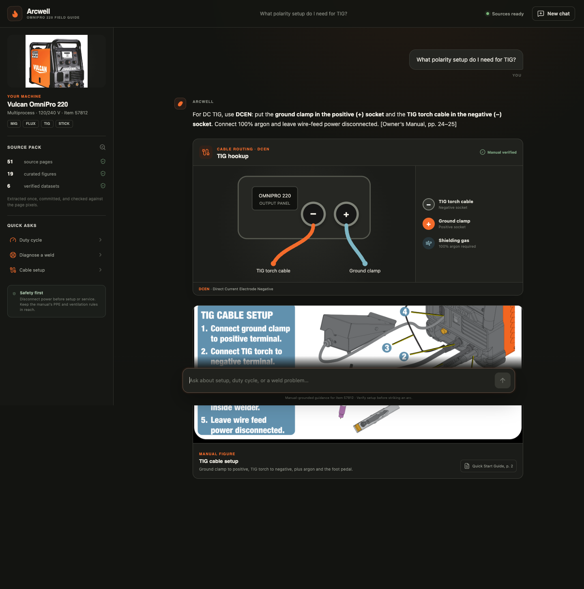
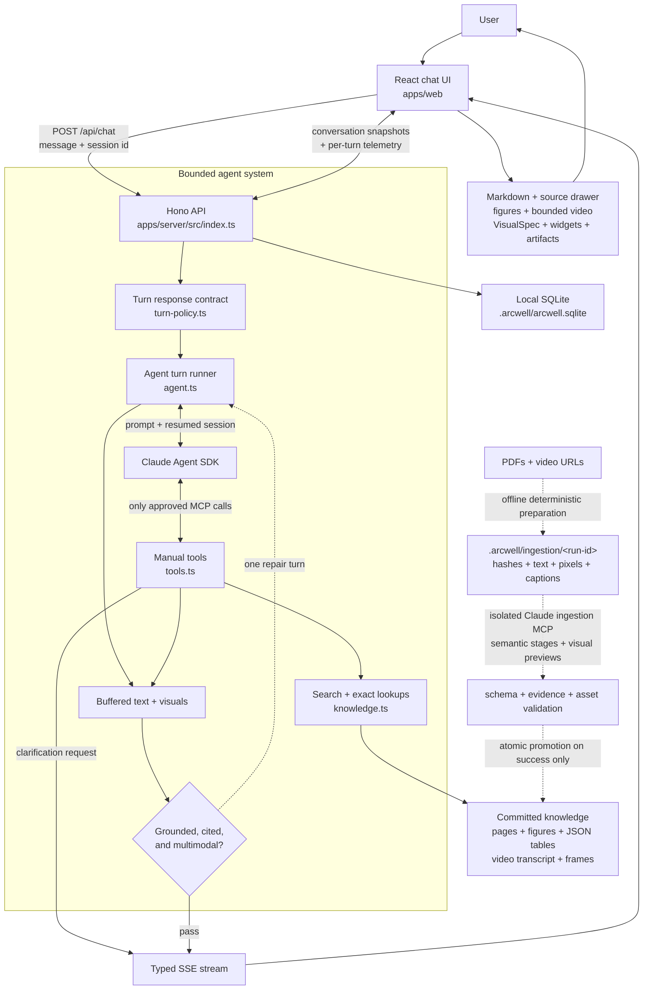

# Arcwell — OmniPro 220 field guide

Arcwell is a visual, source-grounded support agent for the Vulcan OmniPro 220 welder. It uses the [Anthropic Claude Agent SDK](https://platform.claude.com/docs/en/agent-sdk/overview) to reason over the supplied manuals and an indexed, timestamped product-video transcript, then answers with the medium that makes the task easiest to execute: concise prose, an actual manual figure, a bounded YouTube segment, a dynamically composed visual, a certified interactive widget, or a sandboxed generated artifact.



## Run it

Requirements: Node.js 20 or newer and one Anthropic API key.

```bash
cp .env.example .env
# Add ANTHROPIC_API_KEY to .env
npm install
npm run dev
```

`npm run dev` starts the local agent server and Vite. The server creates an ignored SQLite database at `.arcwell/arcwell.sqlite` automatically; no database account, deployment, or second credential is required.

Open [http://localhost:5173](http://localhost:5173). The web app proxies its API and source assets to the server on port 3000.

That is the complete grader path. PDF extraction is deliberately not part of startup; its checked-in output is ready to use.

For a production-style local run:

```bash
npm run build
npm start
# Open http://localhost:3000
```

## What to try

- “What’s the duty cycle for MIG welding at 200A on 240V?”
- “I’m getting porosity in my flux-cored welds. What should I check?”
- “What polarity setup do I need for TIG? Which socket gets the ground clamp?”
- “My wire feeds, but I can’t strike an arc.”
- “Show me which feed-roller groove to use for 0.035 flux-cored wire.”
- “Can this machine TIG weld aluminum?”
- Attach a weld, front-panel, cable, or wire-feed photo and ask “What should I check here?”

The first three are also available as one-click prompts on the welcome screen.

## Architecture



Each browser conversation resumes an Agent SDK session by its SDK session id. The SDK is intentionally isolated from Claude Code’s filesystem tools and local settings: it receives only the active product's knowledge MCP server, a manifest-derived system prompt, and a bounded turn/cost budget. Application policy can require genuinely missing setup details, but it does not write the question, perform lookups, or inject answers; Claude selects the clarification choices and every factual and presentation tool.

The server buffers typed answer parts until a generic response contract confirms the answer is grounded, cited, and appropriately visual. If it is not, the same Agent SDK session gets one bounded repair turn and the rejected content is never shown. Tool activity still streams immediately, and an accepted response can contain concise text, an interactive control, and primary-source evidence in one message.

Completed user and assistant messages are stored in local SQLite as ordered snapshots. Each snapshot preserves text, tool calls and their inputs, unified evidence sources, source figures, video segments, widget data, dynamic visual specifications, clarification cards, artifacts, errors, and the resumable Agent SDK session id. A stable `?chat=` URL restores the conversation after reload or browser navigation. Histories are scoped to a random owner id stored in that browser, while all data stays on the local machine.

### Runtime telemetry

The fixed **Settings** button in the lower-left opens a live usage and reliability panel. Every completed agent turn records the Agent SDK's reported cost, input/output and cache tokens, SDK turn count, API time, total wall time, tool calls and tool errors, response-contract catches, repair attempts, and final success/degraded/error state. The panel shows aggregate totals and averages plus the twelve most recent turns.

Telemetry is stored in a separate local SQLite table and scoped to the same browser-local owner id. It records the conversation title and operational measurements needed to diagnose cost, latency, and reliability; it does not copy prompt or response content into the telemetry table. A validation catch is an observable guardrail event, not a claim that the model hallucinated—the live evaluation suite remains the place where factual and presentation quality are scored.

### Agent tools

| Tool | Purpose |
|---|---|
| `request_clarification` | Emits one Claude-authored question with 2–4 likely choices and an optional free-text re-explanation field, then waits for the same conversation to continue |
| `search_sources` | One MiniSearch entry point over manual pages, curated figure metadata, and timestamped video segments |
| `read_manual_pages` | Up to two exact pages as extracted text plus page pixels for visual verification |
| `inspect_visual_source` | Trims and pre-sizes an approved figure/page, then returns the exact pixels, dimensions, and absolute-pixel coordinate space |
| `preview_visual_annotations` | Returns the source pixels with a numbered coordinate-grid overlay plus per-marker placement issues; only a valid preview can be rendered |
| `lookup_duty_cycle` | Exact published duty-cycle points; never interpolates |
| `lookup_polarity` | Process → polarity, socket routing, gas, and source pages |
| `lookup_troubleshooting` | Symptom matching across troubleshooting and weld-diagnosis data |
| `get_specs` | Published process ranges, materials, wire sizes, and capacities |
| `get_settings_guide` | Source-honest LCD/setup guidance without invented synergic values |
| `search_parts` | Number/name search over the 61-part list |
| `show_figure` | Emits a real manual crop into chat |
| `show_source` | Resolves a generic evidence ref; displays a figure or exact video segment and adds any source type to the message drawer |
| `show_widget` | Emits a certified calculator or checklist for exact duty-cycle, diagnostic, and settings flows |
| `render_visual` | Validates and emits a dynamically composed annotated image, connection diagram, procedure, or comparison |
| `render_artifact` | Emits constrained, inline-only HTML for a novel interactive explanation |

### Interactive clarification

When missing context would materially change the answer, the response contract requires Claude to call the generic `request_clarification` tool. Claude writes the question and mutually exclusive choices for the current conversation; there are no prewritten MIG, TIG, or duty-cycle popups. The React card lets the user select a choice or explain something else in their own words. That response is sent as the next user turn while resuming the same Agent SDK session, so Claude retains both the original question and the clarification it asked.

## Multimodal output

### User-photo diagnostics

The composer accepts one JPEG, PNG, or WebP photo by file picker, paste, or drag and drop. The server decodes the actual pixels with Sharp, rejects unsupported or malformed content, applies orientation, strips metadata, bounds the image dimensions, and stores a normalized JPEG under a content-derived id in the ignored `.arcwell/uploads/` directory. The chat request contains only that approved id—never an arbitrary file path or remote URL.

For the first Agent SDK turn, Arcwell sends the normalized photo and question as native image and text content blocks. Claude must distinguish visible observations from inference, retrieve authoritative manual evidence for product claims, and ask for a better angle or missing setup state when the image is insufficient. A user photo is displayed as **Your photo**, not misrepresented as manual evidence.

Uploaded photos also participate in the same generic visual grammar as manual pixels. The current turn can inspect its approved `upload:photo-…` asset, preview absolute-pixel annotations, and render the verified overlay. There is no weld-defect-specific image tool or fixed overlay. Upload ids from other turns are rejected by the model-facing visual tools, while normalized photos and completed overlays remain addressable when a saved conversation is reopened locally.

### Dynamic visual grammar

Claude can call one content-agnostic `render_visual` tool with a `VisualSpec`: semantic JSON describing an annotated source image, connection graph, ordered procedure, or comparison. There are no topic-specific drawing tools such as `draw_tig_setup`. Claude retrieves the facts and composes the nodes, ports, connections, callouts, steps, and evidence for the current question.

Annotated source images use a stricter fail-closed path. The server deterministically removes exterior whitespace, preserves the crop transform, and resizes only when necessary so Claude and the browser see the same controlled raster. Claude locates targets with absolute pixel coordinates, previews the numbered overlay, and must reuse that exact previewed spec for display. A preview always returns its overlay, coordinate grid, and per-marker issues so Claude can revise the named placements instead of guessing blindly. Unknown assets, coordinates outside the prepared image, and targets on visually blank background remain invalid and cannot be rendered; annotation review is limited to four attempts per turn.

The server also rejects invalid page references, duplicate ids, dangling graph connections, oversized structures, and comparison cells that do not belong to a declared column. React owns responsive layout, accessible text alternatives, keyboard behavior, graph geometry, and application styling; the model never emits executable code for these visuals. Connection arrows and labels are drawn as explicit geometry rather than model-generated pixels, so line weight, arrow attachment, and contrast remain consistent for arbitrary graph content.

### Certified interactive widgets

Three prebuilt widgets remain for high-value flows where a fixed calculation or interaction protects accuracy:

1. **Duty-cycle clock** — shows the exact rating, weld/rest minutes, and an animated ten-minute window. An unpublished amperage displays nearby certified points instead of a made-up estimate.
2. **Troubleshooting checklist** — turns the relevant matrix row into an interactive sequence while filtering process-specific advice. For example, self-shielded flux-cored porosity does not show MIG-only gas checks.
3. **Settings guide** — explains the inputs the machine asks for, supported materials/wire sizes, and how to use the LCD’s recommended marks and a scrap test.

Spatial answers such as polarity routing now use a newly composed connection diagram plus the real manual figure instead of selecting a fixed polarity drawing.

Procedure visuals and troubleshooting checklists are interactive walkthroughs rather than static lists. They appear only after the assistant response is complete, unlock one step at a time, and expose a small **Stuck?** arrow for the current or completed step. That action sends `Help me with step N.` as the next user turn while resuming the same Agent SDK session, so Claude can answer with the walkthrough context intact.

For questions that genuinely need a new interaction, Claude can call `render_artifact`. Generated documents run in `<iframe sandbox="allow-scripts">` without `allow-same-origin`. The frontend injects a strict CSP that blocks network, frames, forms, storage, external images, and external fonts. Runtime failures surface a repair affordance. The server also rejects common network, storage, and embedding primitives before emitting an artifact.

## Knowledge ingestion and provenance

Knowledge ingestion is an offline, fail-closed build. Normal server startup never calls Claude. `KNOWLEDGE_PRODUCT_ID` selects `knowledge/products/<product-id>/` and defaults to `omnipro-220`. The runtime still has a read-only fallback for the pre-migration root OmniPro artifacts until the resumable full-corpus run is finalized; newly ingested products use only the versioned package layout.

The pipeline separates mechanics from interpretation:

- `prepare-pdf.py` hashes and validates arbitrary PDFs, records metadata/outlines, extracts exact text and block geometry, lists image/drawing regions, and renders controlled page pixels.
- `prepare-video.py` fetches the requested caption language through `youtube-transcript-api`, downloads the registered video only as a frame source, and extracts frames on demand. Transcript failure has no fallback provider.
- The isolated Agent SDK runner exposes only stage- and source-appropriate ingestion tools. Claude discovers sections, useful figures, exact dataset candidates, and semantic video ranges; it has no filesystem or shell tool.
- Figure crops and representative frames must be visually inspected. A figure save must repeat the exact bounds and SHA-256 preview hash returned by a valid crop preview.
- Zod and cross-record validators check ids, paths, page/timestamp bounds, heading evidence, crop density/dimensions, dataset types/evidence, transcript overlap, hashes, and referenced assets.
- Final materialization writes a temporary package and atomically promotes it only after the runtime loader accepts it. Failed and interrupted runs retain resumable checkpoints while the prior valid package remains untouched.

Create the ingestion environment once:

```bash
python3 -m venv .venv-ingest
.venv-ingest/bin/pip install -r scripts/ingest/requirements.txt
```

Prepare and ingest arbitrary documents without editing source code:

```bash
INGESTION_PYTHON=.venv-ingest/bin/python npm run ingest -- \
  --product example-product \
  --product-name "Example Product" \
  --input files/owner-manual.pdf \
  --input files/quick-start-guide.pdf
```

For stable source ids, authority labels, caption languages, and mixed PDF/video packages, use a source-only config such as `ingestion/omnipro-220.json`:

```bash
INGESTION_PYTHON=.venv-ingest/bin/python npm run ingest -- \
  --config ingestion/omnipro-220.json
```

Set `CLAUDE_INGESTION_MODEL`, `CLAUDE_INGESTION_MAX_TURNS`, or `CLAUDE_INGESTION_MAX_BUDGET_USD` to override bounded defaults. `--prepare-only` exercises deterministic extraction without an API key. If a model/API run is interrupted after preparation, resume it without downloading or rendering sources again:

```bash
INGESTION_PYTHON=.venv-ingest/bin/python npm run ingest -- \
  --config ingestion/omnipro-220.json \
  --resume-run <run-id>
```

Every finalized manifest records source hashes, model, prompt version, run timestamp, stage attempts/durations/tool counts, token/cost totals, validation status, evidence, and the generating run id. Generated figure records intentionally contain no sample-answer field. Human review is optional after validation and is not encoded as hidden source definitions.

Pages, figures, structured rows, and video segments share one generic evidence-ref model. The Sources drawer resolves titles, filenames, authority, pixels, and timestamps from the active manifest rather than compile-time document ids. The OmniPro deployment can retain deterministic calculators through an optional product adapter; products without an adapter still receive generic grounded search, pages, figures, datasets, and video.

## Two deliberate accuracy decisions

### Duty cycle is not interpolated

The manual certifies discrete operating points. Treating values between those points as a smooth curve would produce a plausible but unsupported safety limit. Arcwell returns an exact rating or explicitly says that the requested point is unpublished and shows the nearest published ratings.

For the sample question, the certified answer is **25% at 200 A on 240 V for MIG: 2.5 minutes welding and 7.5 minutes resting in each ten-minute period** (Owner’s Manual, pp. 7, 14, and 23).

### There is no published synergic output table

The supplied documents explain how to choose wire diameter/material thickness and how the LCD indicates its recommended wire-speed and voltage starting points. They do not publish a complete thickness → wire speed / voltage matrix or the machine’s internal synergic algorithm. Arcwell does not pretend otherwise. Its settings widget validates documented inputs, explains the screen workflow, and directs the user to a same-thickness scrap test instead of fabricating precise numbers.

This also catches a subtle source conflict: the generic selection chart describes AC TIG aluminum in general, but the OmniPro 220 specifications list DC TIG materials only. Machine-specific documentation wins, so Arcwell does not claim this welder can AC TIG aluminum.

## Safety model

- Clarify input voltage, process, or wire/electrode type when it changes the answer.
- Keep gas-shielded MIG and self-shielded flux-cored advice distinct.
- Surface the manual’s disconnect-power, ventilation, PPE, cylinder, and cooling rules in context.
- Do not turn the wiring schematic into casual internal-repair instructions; the manual limits that work to qualified technicians.
- Prefer a source figure for spatial claims and exact page pixels as the final retrieval backstop.

Arcwell is a manual navigation and reasoning aid, not a replacement for training, the product manual, or a qualified welding/electrical professional.

## Repository map

```text
apps/
  server/src/       Agent SDK loop, MCP tools, SSE API, SQLite persistence, deterministic lookups
  web/src/          chat UI, stream parser, dynamic visual renderers, widgets, artifact sandbox
.arcwell/            ignored local SQLite database and normalized user-photo storage
knowledge/
  products/         finalized versioned product packages selected at runtime
scripts/ingest/     CLI plus generic deterministic PDF/video preparation
ingestion/          source-only configs without semantic definitions
files/              original supplied PDFs
```

## Verification

```bash
npm run typecheck
npm test
npm run build
npm run test:e2e
```

The unit suite covers schema/path rejection, evidence/page/timestamp validation, crop preview approval and stale-hash rejection, atomic rollback, bounded repair behavior, plus the existing marquee numeric, polarity, visual, photo, and response-contract regressions. A live one-page package under `knowledge/products/fixture-live/` verifies the real SDK/tool loop; larger live ingestion runs require an Anthropic account with available credit.

The browser suite starts the built local app and stubs only the Agent SDK SSE response, so it does not spend API credits. It verifies the welcome flow, streamed assistant rendering, the interactive duty-cycle widget, clarification choice submission, and the frontend's real production build/runtime path.

The acceptance assertions test meaning, not one exact tool transcript or layout:

- A source/tool prerequisite means the evidence lookup must start before the presentation that consumes it; unrelated reasoning calls may occur in between.
- The incorrect-polarity case deliberately gives Claude a false premise and requires it to correct the premise from `lookup_polarity` before rendering.
- Connection diagrams are checked through endpoint node and port labels—for example, torch → negative and clamp → positive—rather than generated ids, positions, or line text.
- Annotation checks run the server's crop/bounds/background validator, normalize the target against the exact prepared raster, and confirm it lands in the expected semantic source region.
- Unsupported-settings checks reject invented output voltage or IPM values while allowing documented 120 V/240 V input context.

With `ANTHROPIC_API_KEY` configured, run the live acceptance evaluation as well:

```bash
npm run eval
```

It sends ten sample, paraphrased, ambiguous, adversarial, and held-out questions through the real Agent SDK loop. The checks cover Claude-authored clarification choices, evidence-before-presentation prerequisites, exact and unpublished duty-cycle behavior, false-polarity correction, semantic connection graphs, grounded annotation placement, unsupported numeric settings, source-backed widgets, citations, and the machine-specific TIG/aluminum limit. Browser-level automation is intentionally deferred to a later phase.

Set `CLAUDE_MODEL` in `.env` only if you need to override the default `claude-sonnet-4-6` model.
