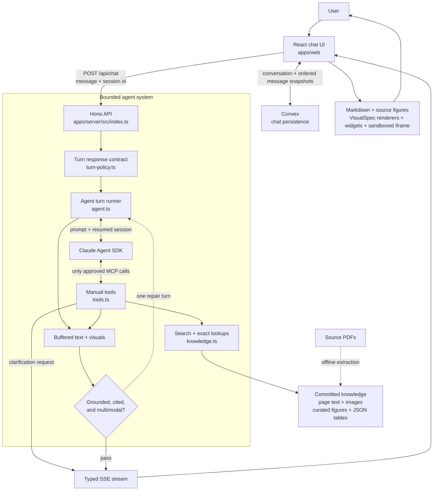

# Arcwell — OmniPro 220 field guide

Arcwell is a visual, source-grounded support agent for the Vulcan OmniPro 220 welder. It uses the [Anthropic Claude Agent SDK](https://platform.claude.com/docs/en/agent-sdk/overview) to reason over the supplied owner’s manual, quick-start guide, and process-selection chart, then answers with the medium that makes the task easiest to execute: concise prose, an actual manual figure, a dynamically composed visual, a certified interactive widget, or a sandboxed generated artifact.


## Run it

Requirements: Node.js 20 or newer, one Anthropic API key, and a Convex development deployment.

```bash
cp .env.example .env
# Add ANTHROPIC_API_KEY to .env
npm install
npx convex dev --once
npm run dev
```

The first Convex command creates or selects a project, pushes the chat schema, and writes the deployment URL to the ignored `.env.local`. `npm run dev` subsequently runs Convex, the agent server, and Vite together.

Open [http://localhost:5173](http://localhost:5173). The web app proxies its API and source assets to the server on port 3000.

That is the complete grader path. PDF extraction is deliberately not part of startup; its checked-in output is ready to use.

For a production-style local run:

```bash
npm run build
npm start
# Open http://localhost:3000
```

## What to try

- “What’s the duty cycle for MIG welding at 200A on 240V?”
- “I’m getting porosity in my flux-cored welds. What should I check?”
- “What polarity setup do I need for TIG? Which socket gets the ground clamp?”
- “My wire feeds, but I can’t strike an arc.”
- “Show me which feed-roller groove to use for 0.035 flux-cored wire.”
- “Can this machine TIG weld aluminum?”

The first three are also available as one-click prompts on the welcome screen.

## Architecture



Each browser conversation resumes an Agent SDK session by its SDK session id. The SDK is intentionally isolated from Claude Code’s filesystem tools and local settings: it receives only the OmniPro MCP tool server, a product-specific system prompt, and a bounded turn/cost budget. Application policy can require genuinely missing setup details, but it does not write the question, perform lookups, or inject answers; Claude selects the clarification choices and every factual and presentation tool.

The server buffers typed answer parts until a generic response contract confirms the answer is grounded, cited, and appropriately visual. If it is not, the same Agent SDK session gets one bounded repair turn and the rejected content is never shown. Tool activity still streams immediately, and an accepted response can contain concise text, an interactive control, and primary-source evidence in one message.

Completed user and assistant messages are stored in Convex as ordered snapshots. Each snapshot preserves text, tool calls and their inputs, source figures, widget data, dynamic visual specifications, clarification cards, artifacts, errors, and the resumable Agent SDK session id. A stable `?chat=` URL restores the conversation after reload or browser navigation. Until authentication is added, histories are scoped to a random owner id stored in that browser.

### Agent tools

| Tool | Purpose |
|---|---|
| `request_clarification` | Emits one Claude-authored question with 2–4 likely choices and an optional free-text re-explanation field, then waits for the same conversation to continue |
| `search_manual` | MiniSearch over page text and curated figure metadata |
| `read_manual_pages` | Up to two exact pages as extracted text plus page pixels for visual verification |
| `inspect_visual_source` | Trims and pre-sizes an approved figure/page, then returns the exact pixels, dimensions, and absolute-pixel coordinate space |
| `preview_visual_annotations` | Rejects blank/out-of-bounds targets and returns the source pixels with a deterministic numbered overlay for visual verification |
| `lookup_duty_cycle` | Exact published duty-cycle points; never interpolates |
| `lookup_polarity` | Process → polarity, socket routing, gas, and source pages |
| `lookup_troubleshooting` | Symptom matching across troubleshooting and weld-diagnosis data |
| `get_specs` | Published process ranges, materials, wire sizes, and capacities |
| `get_settings_guide` | Source-honest LCD/setup guidance without invented synergic values |
| `search_parts` | Number/name search over the 61-part list |
| `show_figure` | Emits a real manual crop into chat |
| `show_widget` | Emits a certified calculator or checklist for exact duty-cycle, diagnostic, and settings flows |
| `render_visual` | Validates and emits a dynamically composed annotated image, connection diagram, procedure, or comparison |
| `render_artifact` | Emits constrained, inline-only HTML for a novel interactive explanation |

### Interactive clarification

When missing context would materially change the answer, the response contract requires Claude to call the generic `request_clarification` tool. Claude writes the question and mutually exclusive choices for the current conversation; there are no prewritten MIG, TIG, or duty-cycle popups. The React card lets the user select a choice or explain something else in their own words. That response is sent as the next user turn while resuming the same Agent SDK session, so Claude retains both the original question and the clarification it asked.

## Multimodal output

### Dynamic visual grammar

Claude can call one content-agnostic `render_visual` tool with a `VisualSpec`: semantic JSON describing an annotated source image, connection graph, ordered procedure, or comparison. There are no topic-specific drawing tools such as `draw_tig_setup`. Claude retrieves the facts and composes the nodes, ports, connections, callouts, steps, and evidence for the current question.

Annotated source images use a stricter fail-closed path. The server deterministically removes exterior whitespace, preserves the crop transform, and resizes only when necessary so Claude and the browser see the same controlled raster. Claude locates targets with absolute pixel coordinates, previews the numbered overlay, and must reuse that exact previewed spec for display. The server rejects unknown assets, coordinates outside the prepared image, and targets that land on visually blank background. If placement cannot be verified, the agent falls back to the unannotated source figure.

The server also rejects invalid page references, duplicate ids, dangling graph connections, oversized structures, and comparison cells that do not belong to a declared column. React owns responsive layout, accessible text alternatives, keyboard behavior, graph geometry, and application styling; the model never emits executable code for these visuals. Connection arrows and labels are drawn as explicit geometry rather than model-generated pixels, so line weight, arrow attachment, and contrast remain consistent for arbitrary graph content.

### Certified interactive widgets

Three prebuilt widgets remain for high-value flows where a fixed calculation or interaction protects accuracy:

1. **Duty-cycle clock** — shows the exact rating, weld/rest minutes, and an animated ten-minute window. An unpublished amperage displays nearby certified points instead of a made-up estimate.
2. **Troubleshooting checklist** — turns the relevant matrix row into an interactive sequence while filtering process-specific advice. For example, self-shielded flux-cored porosity does not show MIG-only gas checks.
3. **Settings guide** — explains the inputs the machine asks for, supported materials/wire sizes, and how to use the LCD’s recommended marks and a scrap test.

Spatial answers such as polarity routing now use a newly composed connection diagram plus the real manual figure instead of selecting a fixed polarity drawing.

For questions that genuinely need a new interaction, Claude can call `render_artifact`. Generated documents run in `<iframe sandbox="allow-scripts">` without `allow-same-origin`. The frontend injects a strict CSP that blocks network, frames, forms, storage, external images, and external fonts. Runtime failures surface a repair affordance. The server also rejects common network, storage, and embedding primitives before emitting an artifact.

## Knowledge extraction and provenance

The committed `knowledge/` directory is produced by `scripts/extract/extract.py` using PyMuPDF. It renders every PDF page at 144 DPI, extracts per-page text, crops the figure library using reviewed page coordinates, and writes the manual map and search documents.

To rebuild it (not required to run the app):

```bash
python3 -m venv .venv-extract
.venv-extract/bin/pip install -r scripts/extract/requirements.txt
.venv-extract/bin/python scripts/extract/extract.py
```

The structured data under `knowledge/tables/` was transcribed and spot-checked against rendered page pixels:

- `duty_cycles.json` — 18 published points across MIG, TIG, stick, 120 V, and 240 V
- `specs.json` — process ranges, inputs, supported materials, and wire capacities
- `polarity.json` — MIG, self-shielded flux-cored, TIG, and stick routing
- `troubleshooting.json` and `weld_diagnosis.json` — symptom/cause/action data with figure ids
- `settings_guide.json` — documented LCD inputs and machine limitations
- `parts.json` — all 61 numbered parts and diagram references

Every lookup result carries manual page provenance. The model is instructed to cite those pages and to use a lookup or exact page read for every operational number.

## Two deliberate accuracy decisions

### Duty cycle is not interpolated

The manual certifies discrete operating points. Treating values between those points as a smooth curve would produce a plausible but unsupported safety limit. Arcwell returns an exact rating or explicitly says that the requested point is unpublished and shows the nearest published ratings.

For the sample question, the certified answer is **25% at 200 A on 240 V for MIG: 2.5 minutes welding and 7.5 minutes resting in each ten-minute period** (Owner’s Manual, pp. 7, 14, and 23).

### There is no published synergic output table

The supplied documents explain how to choose wire diameter/material thickness and how the LCD indicates its recommended wire-speed and voltage starting points. They do not publish a complete thickness → wire speed / voltage matrix or the machine’s internal synergic algorithm. Arcwell does not pretend otherwise. Its settings widget validates documented inputs, explains the screen workflow, and directs the user to a same-thickness scrap test instead of fabricating precise numbers.

This also catches a subtle source conflict: the generic selection chart describes AC TIG aluminum in general, but the OmniPro 220 specifications list DC TIG materials only. Machine-specific documentation wins, so Arcwell does not claim this welder can AC TIG aluminum.

## Safety model

- Clarify input voltage, process, or wire/electrode type when it changes the answer.
- Keep gas-shielded MIG and self-shielded flux-cored advice distinct.
- Surface the manual’s disconnect-power, ventilation, PPE, cylinder, and cooling rules in context.
- Do not turn the wiring schematic into casual internal-repair instructions; the manual limits that work to qualified technicians.
- Prefer a source figure for spatial claims and exact page pixels as the final retrieval backstop.

Arcwell is a manual navigation and reasoning aid, not a replacement for training, the product manual, or a qualified welding/electrical professional.

## Repository map

```text
apps/
  server/src/       Agent SDK loop, MCP tools, SSE API, deterministic lookups
  web/src/          chat UI, stream parser, dynamic visual renderers, widgets, artifact sandbox
convex/              conversation schema, history queries, and persistence mutations
knowledge/
  pages/            51 committed page PNG/TXT pairs
  figures/          reviewed visual crops
  tables/           exact structured product data
  index.json        compact section → page map for the system prompt
scripts/extract/    reproducible offline PDF build
files/              original supplied PDFs
```

## Verification

```bash
npm run typecheck
npm test
npm run build
```

The unit suite locks the marquee numeric and polarity answers, the non-interpolation rule, process-specific porosity filtering, generic clarification and response contracts, dynamic graph/annotation validation, deterministic crop geometry, blank-target rejection, approved source resolution, required tool-selected visuals, and the bounded repair path.

The acceptance assertions test meaning, not one exact tool transcript or layout:

- A source/tool prerequisite means the evidence lookup must start before the presentation that consumes it; unrelated reasoning calls may occur in between.
- The incorrect-polarity case deliberately gives Claude a false premise and requires it to correct the premise from `lookup_polarity` before rendering.
- Connection diagrams are checked through endpoint node and port labels—for example, torch → negative and clamp → positive—rather than generated ids, positions, or line text.
- Annotation checks run the server's crop/bounds/background validator, normalize the target against the exact prepared raster, and confirm it lands in the expected semantic source region.
- Unsupported-settings checks reject invented output voltage or IPM values while allowing documented 120 V/240 V input context.

With `ANTHROPIC_API_KEY` configured, run the live acceptance evaluation as well:

```bash
npm run eval
```

It sends ten sample, paraphrased, ambiguous, adversarial, and held-out questions through the real Agent SDK loop. The checks cover Claude-authored clarification choices, evidence-before-presentation prerequisites, exact and unpublished duty-cycle behavior, false-polarity correction, semantic connection graphs, grounded annotation placement, unsupported numeric settings, source-backed widgets, citations, and the machine-specific TIG/aluminum limit. Browser-level automation is intentionally deferred to a later phase.

Set `CLAUDE_MODEL` in `.env` only if you need to override the default `claude-sonnet-4-6` model.
