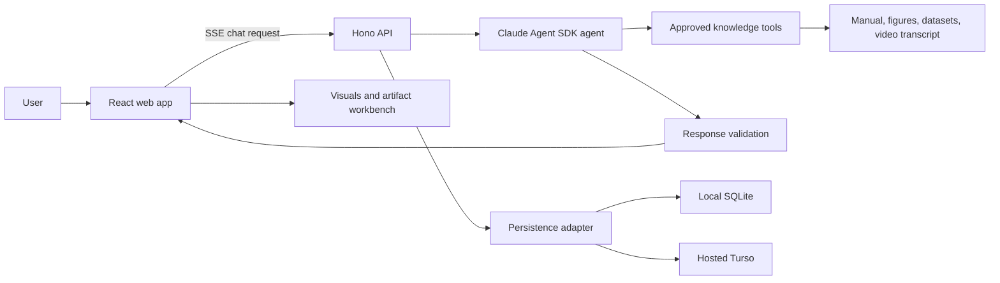

# OmniPro 220 Assistant

The OmniPro 220 Assistant is a source-grounded support agent for the Vulcan OmniPro 220 welder. Ask questions in plain language and get concise answers backed by the supplied manual and product-video transcript.


## Features

- Answers questions about setup, welding processes, settings, specifications, parts, and troubleshooting.
- Uses the product manual, structured lookup data, figures, and timestamped video segments as evidence.
- Shows citations and the relevant source figure or video segment when helpful.
- Accepts a local weld, front-panel, cable, or wire-feed photo for grounded visual guidance.
- Presents complex answers as metric summaries, reference cards, connection diagrams, annotated images, procedures, or comparisons.
- Generates sandboxed artifacts such as HTML, SVG, Mermaid, Markdown, React, or code when a reusable interactive document is useful.
- Asks for missing context—such as process, input voltage, or wire type—when it changes the answer.
- Preserves conversations and per-turn telemetry locally, or in Turso when deployed.

## How it works

1. The React web app sends each question to the Hono server over a typed Server-Sent Events stream.
2. A single Claude Agent SDK agent uses only the approved product-knowledge tools.
3. Search and deterministic lookup tools retrieve exact manual pages, figures, video timestamps, and published product values.
4. The server validates grounding, citations, and any requested visual output before showing the answer. A failed response can receive one bounded repair turn.
5. The web app renders the accepted response, evidence, tool timeline, visuals, and artifacts.

Product knowledge is prepared offline and committed as a read-only package. Normal server startup does not call Claude to ingest or interpret source documents.

## Architecture



The repository is split into two applications:

- `apps/web` contains the chat interface, streaming client, source drawer, generic visuals, photo flow, and artifact runtime.
- `apps/server` contains the Hono API, access control, Claude Agent SDK loop, MCP-style knowledge tools, response validation, persistence, and telemetry.
- `api` adapts the server for Vercel functions.
- `scripts/ingest` prepares and validates the source packages used by the server.

## Tech stack

- **Frontend:** React 19, Vite, TypeScript, React Markdown, Mermaid, Lucide icons.
- **Backend:** Node.js 22, Hono, TypeScript, Zod, Sharp, MiniSearch.
- **Agent runtime:** Anthropic Claude Agent SDK with a bounded single-agent loop and approved product-knowledge tools.
- **Persistence:** SQLite with `better-sqlite3` locally; Turso/libSQL for hosted deployments.
- **Streaming:** Typed Server-Sent Events from the Hono API to the React client.
- **Artifacts:** Sandboxed `iframe` runtime for HTML, SVG, Mermaid, Markdown, React, and code outputs.
- **Testing:** Node test runner, TypeScript checks, Playwright end-to-end tests, and a live acceptance evaluation.
- **Deployment:** Vercel static frontend plus a Hono serverless function.

## Run locally

Requirements: Node.js 22 and an Anthropic API key.

```bash
cp .env.example .env
# Add ANTHROPIC_API_KEY to .env
npm install
npm run dev
```

Open [http://localhost:5173](http://localhost:5173). The web app runs on port 5173 and proxies API requests to the server on port 3000. Local development uses an ignored SQLite database at `.prox/prox.sqlite`; no database account is required.

For a production-style local run:

```bash
npm run build
npm start
# Open http://localhost:3000
```

## Try these questions

- What’s the duty cycle for MIG welding at 200A on 240V?
- I’m getting porosity in my flux-cored welds. What should I check?
- What polarity setup do I need for TIG? Which socket gets the ground clamp?
- My wire feeds, but I can’t strike an arc.
- Show me which feed-roller groove to use for 0.035 flux-cored wire.
- Can this machine TIG weld aluminum?
- Attach a photo and ask: What should I check here?

## Deploy to Vercel

The repository can be imported into Vercel as-is. Configure these server-side environment variables:

- `ANTHROPIC_API_KEY` — required for agent turns.
- `PROX_ACCESS_PASSWORD` — shared password for the deployed app.
- `PROX_SESSION_SECRET` — separate random secret used to sign session cookies.
- `TURSO_DATABASE_URL` and `TURSO_AUTH_TOKEN` — durable hosted chat history and telemetry.

Add Turso to the linked Vercel project with:

```bash
npx vercel integration add tursocloud
```

The application creates its schema automatically. If Turso is unavailable, chat still works but the UI reports that history is disabled. Hosted photo uploads are currently disabled because local filesystem storage is not durable on Vercel.

Local development remains password-free when the access-control variables are not set. To test the stateless hosted-style mode locally:

```bash
PROX_CHAT_STORAGE=disabled npm run dev
```

The current production deployment is [prox-challenge-rouge.vercel.app](https://prox-challenge-rouge.vercel.app).

## Knowledge ingestion

Ingestion is an offline, validated pipeline for turning PDFs and product videos into a product package:

- PDF text, page geometry, figures, and page pixels are extracted deterministically.
- Video captions and selected frames are indexed with source timestamps.
- Claude may identify useful sections, figures, dataset records, and video ranges through isolated ingestion tools.
- Zod and cross-record checks validate paths, bounds, hashes, evidence, and referenced assets.
- A new package is promoted atomically only after validation succeeds; the previous valid package remains available after a failed run.

Create the ingestion environment once:

```bash
python3 -m venv .venv-ingest
.venv-ingest/bin/pip install -r scripts/ingest/requirements.txt
```

Prepare and ingest a configured source package:

```bash
INGESTION_PYTHON=.venv-ingest/bin/python npm run ingest -- \
  --config ingestion/omnipro-220.json
```

Use `--prepare-only` for deterministic extraction without an API key. See `.env.example` for ingestion-specific model, budget, and Python settings.

## Safety and accuracy

- Duty-cycle answers use published points only; the assistant does not interpolate unsupported values.
- Gas-shielded MIG and self-shielded flux-cored guidance are kept separate.
- Machine-specific documentation takes precedence over generic process guidance.
- Safety instructions are surfaced in context, including PPE, ventilation, gas-cylinder, cooling, and power-disconnect guidance.
- Wiring diagrams are treated as reference material, not casual internal-repair instructions.

This assistant is a manual-navigation and reasoning aid, not a replacement for training, the product manual, or a qualified welding/electrical professional.

## Repository map

```text
apps/server/src/       Hono API, agent loop, knowledge tools, persistence, ingestion
apps/web/src/          React chat UI, streaming, visuals, artifact workbench
api/                   Vercel function adapter
knowledge/products/    Finalized product packages selected at runtime
scripts/ingest/        PDF/video preparation and ingestion CLI
ingestion/             Source-only ingestion configs
files/                 Supplied source PDFs
tests/e2e/             Playwright browser coverage
.prox/                 Ignored local database and photo storage
```

## Verification

```bash
npm run typecheck
npm test
npm run build
npm run test:e2e
```

With `ANTHROPIC_API_KEY` configured, run the live acceptance evaluation with:

```bash
npm run eval
```

## Current limitations

- Hosted photo uploads require object storage such as Vercel Blob and are currently disabled.
- Hosted follow-up turns use a bounded recent transcript rather than durable Agent SDK session files.
- The shared password is not user authentication and has no per-user spending limits or login throttling.
- The Vercel function must complete each turn within 60 seconds.
- Product-specific deterministic calculators currently cover OmniPro 220; the generic knowledge package supports broader source-grounded retrieval.

## Environment variables

| Variable | Purpose |
|---|---|
| `ANTHROPIC_API_KEY` | Server-side Claude Agent SDK credential |
| `PROX_ACCESS_PASSWORD` | Optional local / required hosted shared password |
| `PROX_SESSION_SECRET` | Session-cookie signing secret |
| `TURSO_DATABASE_URL` | Hosted Turso database URL |
| `TURSO_AUTH_TOKEN` | Hosted Turso credential |
| `PROX_CHAT_STORAGE` | Force `sqlite`, `turso`, or `disabled` |
| `PROX_PHOTO_STORAGE` | Force `local` or `disabled` photo storage |
| `PHOTO_UPLOAD_DIR` | Override the ignored local photo directory |
| `CLAUDE_MODEL` | Override the runtime Claude model |
| `KNOWLEDGE_PRODUCT_ID` | Select `knowledge/products/<id>` |

Ingestion-specific variables are documented in `.env.example`.
