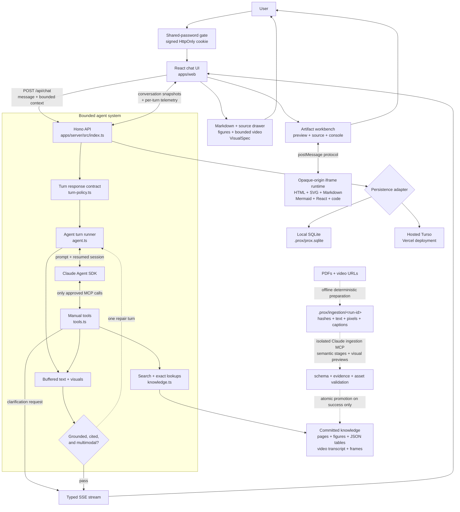

# OmniPro 220 Assistant

The OmniPro 220 Assistant is a visual, source-grounded support agent for the Vulcan OmniPro 220 welder. It uses the [Anthropic Claude Agent SDK](https://platform.claude.com/docs/en/agent-sdk/overview) to reason over the supplied manuals and an indexed, timestamped product-video transcript, then answers with the medium that makes the task easiest to execute: concise prose, an actual manual figure, a bounded YouTube segment, a dynamically composed visual, or a sandboxed generated artifact.


## Run it

Requirements: Node.js 22 and one Anthropic API key.

```bash
cp .env.example .env
# Add ANTHROPIC_API_KEY to .env
npm install
npm run dev
```

`npm run dev` starts the local agent server and Vite. The server creates an ignored SQLite database at `.prox/prox.sqlite` automatically; no database account, deployment, or second credential is required.

Open [http://localhost:5173](http://localhost:5173). The web app proxies its API and source assets to the server on port 3000.

That is the complete grader path. PDF extraction is deliberately not part of startup; its checked-in output is ready to use.

For a production-style local run:

```bash
npm run build
npm start
# Open http://localhost:3000
```

## Deploy to Vercel

The current production deployment is [prox-challenge-rouge.vercel.app](https://prox-challenge-rouge.vercel.app). It uses the shared-password gate and hosted Turso persistence described below; the password itself is intentionally not stored in this repository.

The repository can be imported into Vercel as-is. Add `ANTHROPIC_API_KEY`,
`PROX_ACCESS_PASSWORD`, and a separate random `PROX_SESSION_SECRET` in the
project's environment variables and deploy. The checked-in `vercel.json` builds
the React app, routes `/api/*` to the Hono function, and includes the read-only
product knowledge in that function.

The password gate is enforced by the server for every non-public API route, not
only by the React page. A successful login creates a signed, HttpOnly cookie that
lasts seven days. Vercel fails closed if either access-control variable is absent,
so an incomplete deployment cannot expose the LLM endpoint. Local development
remains password-free when neither variable is set; set both locally to test the
gate before deployment.

Provision the hosted database through the linked Vercel project:

```bash
npx vercel integration add tursocloud
```

Accept the Marketplace terms and choose the free plan when prompted. The native
integration creates the database and injects `TURSO_DATABASE_URL` and
`TURSO_AUTH_TOKEN` into Development, Preview, and Production automatically. Keep
both values server-only; neither belongs in Git or a browser-exposed variable.

Vercel uses Turso for durable saved conversation history and telemetry when
`TURSO_DATABASE_URL` and `TURSO_AUTH_TOKEN` are configured. The schema is created
idempotently by the application. If either credential is missing or the database
cannot initialize, the UI falls back to an explicit no-history state while chat
generation, sources, tools, visuals, and artifacts continue to work.

A local clone still defaults to SQLite automatically, so `npm run dev` retains
chats and telemetry without a Turso account. To test the hosted database locally,
set both Turso credentials and `PROX_CHAT_STORAGE=turso`.

Hosted follow-up turns carry a bounded recent transcript from the current tab,
so they do not depend on an Agent SDK session file surviving a serverless cold
start. Local mode continues to use the SDK's resumable sessions.

Photo uploads use a separate local filesystem directory rather than SQLite, so
the attachment control is also disabled on Vercel. It remains available locally;
durable hosted uploads can be added later with object storage such as Vercel Blob.

To exercise the same stateless mode locally, set:

```bash
PROX_CHAT_STORAGE=disabled npm run dev
```

Do not set `PROX_CHAT_STORAGE=sqlite` on Vercel: function filesystems are
ephemeral, so a SQLite file would not provide durable or consistently shared
history.

The Vercel deployment is one static Vite frontend plus one Hono serverless
function. The function is configured for a 60-second maximum duration. Builds
should run on Vercel's Linux builder rather than deploying a function prebuilt on
macOS because Sharp includes platform-specific native dependencies.

## What to try

- “What’s the duty cycle for MIG welding at 200A on 240V?”
- “I’m getting porosity in my flux-cored welds. What should I check?”
- “What polarity setup do I need for TIG? Which socket gets the ground clamp?”
- “My wire feeds, but I can’t strike an arc.”
- “Show me which feed-roller groove to use for 0.035 flux-cored wire.”
- “Can this machine TIG weld aluminum?”
- Attach a weld, front-panel, cable, or wire-feed photo and ask “What should I check here?”

The first three are also available as one-click prompts on the welcome screen.

## Architecture



This is a single-agent runtime. Tool calls are operations performed by that agent, not separate agents or background workers. Local conversations resume an Agent SDK session by its SDK session id. Vercel does not assume SDK session files survive a serverless cold start, so hosted follow-ups instead send up to the twelve most recent text messages as bounded context. The SDK is intentionally isolated from Claude Code’s filesystem tools and local settings: it receives only the active product's knowledge MCP server, a manifest-derived system prompt, and a bounded turn/cost budget. Application policy can require genuinely missing setup details, but it does not write the question, perform lookups, or inject answers; Claude selects the clarification choices and every factual and presentation tool.

The server buffers typed answer parts until a generic response contract confirms the answer is grounded, cited, and appropriately visual. If it is not, the same Agent SDK session gets one bounded repair turn and the rejected content is never shown. Tool activity still streams immediately, and an accepted response can contain concise text, an interactive control, and primary-source evidence in one message.

Completed user and assistant messages are stored as ordered snapshots in local SQLite or hosted Turso. Each snapshot preserves text, tool calls and their inputs, unified evidence sources, source figures, video segments, dynamic visual specifications, clarification cards, complete artifact revisions, errors, and the resumable Agent SDK session id. A compatibility adapter converts widget payloads in older saved chats into the current generic visual format, while legacy HTML artifacts open as revision-one documents. A stable `?chat=` URL restores the conversation after reload or browser navigation. Histories are scoped to a random owner id stored in that browser; local mode keeps the data on that machine, while Vercel stores it in the configured Turso database.

### Runtime request lifecycle

1. `AccessGate` checks `/api/auth/session`; local development opens automatically when access control is not configured.
2. The browser app restores the requested `?chat=` snapshot, accepts text or a supported local photo, and sends `POST /api/chat` with bounded recent text and the latest artifact revisions.
3. Hono validates the request with Zod, creates an abortable SSE stream, and emits a conversation id.
4. A deterministic turn policy identifies grounding requirements and assigns a presentation level: required, preferred, or text-first. It can suggest generic visual kinds without selecting a topic-specific component.
5. The single Claude agent reasons with only the approved knowledge MCP tools. Tool start/end events stream immediately into the expandable timeline.
6. Text and presentation events are buffered until the response validator confirms the required grounding, citation, and visual contract.
7. A failed contract triggers one lower-budget repair attempt in the same SDK session; rejected answer content is never shown.
8. The accepted typed parts stream into React and the completed user/assistant snapshots and operational telemetry are persisted independently.

### Tool-call timeline

Every model-facing tool is wrapped with typed `tool_start` and `tool_end` events. While a turn is active, the React timeline stays open and shows whether the agent is using a tool or thinking about its next step. Each call can be expanded to inspect its JSON input. It collapses when the answer finishes but remains available in the saved message. Raw tool outputs are intentionally not exposed in the current UI.

### Runtime telemetry

The fixed **Settings** button in the lower-left opens a live usage and reliability panel. Every completed agent turn records the Agent SDK's reported cost, input/output and cache tokens, SDK turn count, API time, total wall time, tool calls and tool errors, response-contract catches, repair attempts, and final success/degraded/error state. The panel shows aggregate totals and averages plus the twelve most recent turns.

Telemetry is stored in a separate table in the selected persistence backend and scoped to the same browser-local owner id. It records the conversation title and operational measurements needed to diagnose cost, latency, and reliability; it does not copy prompt or response content into the telemetry table. A validation catch is an observable guardrail event, not a claim that the model hallucinated—the live evaluation suite remains the place where factual and presentation quality are scored.

### Agent tools

| Tool | Purpose |
|---|---|
| `request_clarification` | Emits one Claude-authored question with 2–4 likely choices and an optional free-text re-explanation field, then waits for the same conversation to continue |
| `search_sources` | One MiniSearch entry point over manual pages, curated figure metadata, verified dataset records, and timestamped video segments |
| `read_manual_pages` | Up to two exact pages as extracted text plus page pixels for visual verification |
| `inspect_visual_source` | Trims and pre-sizes an approved figure/page, then returns the exact pixels, dimensions, and absolute-pixel coordinate space |
| `preview_visual_annotations` | Returns the source pixels with a numbered coordinate-grid overlay plus per-marker placement issues; only a valid preview can be rendered |
| `lookup_duty_cycle` | Exact published duty-cycle points; never interpolates |
| `lookup_polarity` | Process → polarity, socket routing, gas, and source pages |
| `lookup_troubleshooting` | Symptom matching across troubleshooting and weld-diagnosis data |
| `get_specs` | Published process ranges, materials, wire sizes, and capacities |
| `get_settings_guide` | Source-honest LCD/setup guidance without invented synergic values |
| `search_parts` | Number/name search over the 61-part list |
| `show_figure` | Emits a real manual crop into chat |
| `show_source` | Resolves a generic evidence ref; displays a figure or exact video segment and adds any source type to the message drawer |
| `render_visual` | Validates and emits a dynamically composed metric summary, reference card, annotated image, connection diagram, procedure, or comparison |
| `render_artifact` | Creates or fully replaces one stable, typed artifact revision (HTML, SVG, Markdown, Mermaid, React, or code) |

### Interactive clarification

When missing context would materially change the answer, the response contract requires Claude to call the generic `request_clarification` tool. Claude writes the question and mutually exclusive choices for the current conversation; there are no prewritten MIG, TIG, or duty-cycle popups. The React card lets the user select a choice or explain something else in their own words. That response is sent as the next user turn while resuming the same Agent SDK session, so Claude retains both the original question and the clarification it asked.

## Multimodal output

### Output inventory

The assistant has two deliberately separate generation paths. Routine product guidance uses schema-validated, source-grounded presentation components; a genuinely novel or reusable interaction uses the sandboxed artifact runtime. The complete response surface is:

| Family | Available output | Typical use |
|---|---|---|
| Answer | Markdown prose, lists, and tables | Direct explanations, cautions, and concise instructions |
| Structured visual | **Metric summary** | Related ratings, measurements, duty-cycle values, and work/rest intervals |
| Structured visual | **Reference card** | Grouped settings, specifications, compatible materials, and limits |
| Structured visual | **Connection diagram** | Polarity, socket routing, cable paths, gas paths, and other relationships |
| Structured visual | **Annotated image** | Validated numbered markers over an inspected manual figure or current user photo |
| Structured visual | **Procedure walkthrough** | Sequential setup or troubleshooting steps with per-step **Stuck?** help |
| Structured visual | **Comparison** | Side-by-side processes, configurations, settings, or choices |
| Primary source | Manual figure | The exact relevant curated crop from a supplied document |
| Primary source | Bounded video segment | A product demonstration constrained to its indexed start and end timestamps |
| Primary source | Uploaded photo | The user's normalized image, clearly distinguished from authoritative evidence |
| Artifact | **React** | Stateful calculators, configurators, selectors, sliders, tabs, checklists, and simulations |
| Artifact | **HTML** | Self-contained interactive HTML, CSS, and JavaScript documents |
| Artifact | **SVG** | Custom illustrations, schematics, and static spatial explanations |
| Artifact | **Mermaid** | Flowcharts, decision trees, sequences, timelines, and relationship diagrams |
| Artifact | **Markdown** | Reusable guides, checklists, reference documents, and reports |
| Artifact | **Code** | Source code when the source itself is the deliverable |
| Conversation control | Clarification card | Claude-authored mutually exclusive choices plus optional free-text context |
| Conversation control | Tool-call timeline | Live and saved expandable tool names, inputs, and running/completed/failed states |
| Evidence control | Source drawer | Deduplicated document, structured-data, figure, and video provenance |

The six structured visuals are generic renderers rather than product-specific widgets: Claude supplies semantic content retrieved from evidence, while React owns layout and interaction. Artifacts are open-ended revisioned documents with stable identifiers, complete source, preview/source modes, captured console output, and repair support. They are not used as a less reliable replacement for ordinary source-grounded welding guidance.

### User-photo diagnostics

The composer accepts one JPEG, PNG, or WebP photo by file picker, paste, or drag and drop. The server decodes the actual pixels with Sharp, rejects unsupported or malformed content, applies orientation, strips metadata, bounds the image dimensions, and stores a normalized JPEG under a content-derived id in the ignored `.prox/uploads/` directory. The chat request contains only that approved id—never an arbitrary file path or remote URL.

For the first Agent SDK turn, the assistant sends the normalized photo and question as native image and text content blocks. Claude must distinguish visible observations from inference, retrieve authoritative manual evidence for product claims, and ask for a better angle or missing setup state when the image is insufficient. A user photo is displayed as **Your photo**, not misrepresented as manual evidence.

Uploaded photos also participate in the same generic visual grammar as manual pixels. The current turn can inspect its approved `upload:photo-…` asset, preview absolute-pixel annotations, and render the verified overlay. There is no weld-defect-specific image tool or fixed overlay. Upload ids from other turns are rejected by the model-facing visual tools, while normalized photos and completed overlays remain addressable when a saved conversation is reopened locally.

### Dynamic visual grammar

Claude can call one content-agnostic `render_visual` tool with a `VisualSpec`: semantic JSON describing a metric summary, grouped reference card, annotated source image, connection graph, ordered procedure, or comparison. There are no topic-specific presentation tools such as `draw_tig_setup` or `show_duty_widget`. Claude retrieves the facts with deterministic lookup/search tools and composes the presentation from those returned facts and evidence.

The presentation policy intentionally treats visuals as more than a last resort. Spatial/photo questions and explicit requests require one; procedures, troubleshooting, comparisons, settings, grouped facts, and multi-value ratings prefer one; a genuinely simple fact stays text-first. “Preferred” is prompt guidance rather than a repair-loop requirement, so a visual is encouraged whenever it improves scanning or comprehension without forcing decorative output.

Annotated source images use a stricter fail-closed path. The server deterministically removes exterior whitespace, preserves the crop transform, and resizes only when necessary so Claude and the browser see the same controlled raster. Claude locates targets with absolute pixel coordinates, previews the numbered overlay, and must reuse that exact previewed spec for display. A preview always returns its overlay, coordinate grid, and per-marker issues so Claude can revise the named placements instead of guessing blindly. Unknown assets, coordinates outside the prepared image, and targets on visually blank background remain invalid and cannot be rendered; annotation review is limited to four attempts per turn.

The server also rejects invalid page references, duplicate ids, dangling graph connections, oversized structures, and comparison cells that do not belong to a declared column. React owns responsive layout, accessible text alternatives, keyboard behavior, graph geometry, and application styling; the model never emits executable code for these visuals. Connection arrows and labels are drawn as explicit geometry rather than model-generated pixels, so line weight, arrow attachment, and contrast remain consistent for arbitrary graph content.

### Generic presentation primitives

Facts and presentation are deliberately separate. Product adapters return exact duty-cycle rows, polarity routing, troubleshooting checks, specifications, settings guidance, and parts evidence; none emits UI. Claude can then select from six generic, schema-validated primitives:

1. **Metric summary** for related ratings, measurements, and intervals.
2. **Reference card** for grouped settings, limits, supported materials, and compact facts.
3. **Connection diagram** for socket routing, flows, and other relationships.
4. **Annotated image** for verified locations on inspected manual or user pixels.
5. **Procedure** for ordered physical actions or diagnostic checks.
6. **Comparison** for side-by-side choices.

This means duty cycle is not tied to a duty-cycle component, settings are not tied to a settings component, and troubleshooting is not tied to a diagnostic widget. The same renderer can present held-out topics with new semantic content. Accuracy still comes from deterministic lookup results and source validation, not the shape of the UI.

Procedure visuals remain interactive walkthroughs. They appear only after the assistant response is complete, unlock one step at a time, and expose a small **Stuck?** arrow for the current or completed step. That action sends the exact step number, title, instruction, and evidence as the next user turn while retaining a short human-readable message in chat, so Claude can explain the actual step rather than guessing what “step 2” referred to.

### Claude-style artifact runtime

Artifacts are a distinct document lifecycle, not another collection of product widgets. The implementation follows the public behavior described in [Reverse Engineering Claude Artifacts](https://www.reidbarber.com/blog/reverse-engineering-claude-artifacts): each artifact has a stable model-authored identifier, MIME-like type, title, complete source, and monotonically increasing revision. A follow-up edit reuses the identifier and sends a full replacement rather than a patch. The latest revisions are returned as bounded turn context so this still works on Vercel, where an Agent SDK session may not survive a cold start.

Claude can choose `text/html`, `image/svg+xml`, `text/markdown`, `application/vnd.ant.mermaid`, `application/vnd.ant.react`, or `application/vnd.ant.code`. React source is compiled in the browser with Sucrase and receives React as a scoped global; Mermaid uses its strict security mode. The chat workbench exposes **Preview** and **Source**, revision metadata, source copying, captured console output, automatic sizing, and a repair action that names the failed artifact and revision.

The renderer is a separate Vite entry point emitted as one self-contained production document. It runs inside `<iframe sandbox="allow-scripts">` without `allow-same-origin`; a narrow versioned `postMessage` protocol is the only parent/runtime bridge. CSP blocks network connections, external frames, forms, storage, external media, and fonts, while the server rejects common active-capability primitives before streaming source. Development adds `allow-same-origin` only so Vite can load its module graph; the production build was browser-verified with the opaque-origin sandbox intact.

This is an independent, behavior-compatible implementation based on public observation—not Anthropic source code, private APIs, or a proxy to Claude's hosted artifact service. The deterministic `VisualSpec` path still exists for source-grounded manual diagrams and walkthroughs because model-generated executable code is the wrong reliability boundary for routine welding guidance; artifacts are selected for substantial reusable documents or interactions.

## Knowledge ingestion and provenance

Knowledge ingestion is an offline, fail-closed build. Normal server startup never calls Claude. `KNOWLEDGE_PRODUCT_ID` selects `knowledge/products/<product-id>/` and defaults to the finalized `omnipro-220` package. Generic document search, pages, figures, datasets, video, and provenance come from that manifest-defined package. The OmniPro deployment additionally enables checked-in product-specific deterministic adapters; other products do not inherit those adapters merely because the legacy OmniPro tables exist.

The pipeline separates mechanics from interpretation:

- `prepare-pdf.py` hashes and validates arbitrary PDFs, records metadata/outlines, extracts exact text and block geometry, lists image/drawing regions, and renders controlled page pixels.
- `prepare-video.py` fetches the requested caption language through `youtube-transcript-api`, downloads the registered video only as a frame source, and extracts frames on demand. Transcript failure has no fallback provider.
- The isolated Agent SDK runner exposes only stage- and source-appropriate ingestion tools. Claude discovers sections, useful figures, exact dataset candidates, and semantic video ranges; it has no filesystem or shell tool.
- Figure crops and representative frames must be visually inspected. A figure save must repeat the exact bounds and SHA-256 preview hash returned by a valid crop preview.
- Zod and cross-record validators check ids, paths, page/timestamp bounds, heading evidence, crop density/dimensions, dataset types/evidence, transcript overlap, hashes, and referenced assets.
- Final materialization writes a temporary package and atomically promotes it only after the runtime loader accepts it. Failed and interrupted runs retain resumable checkpoints while the prior valid package remains untouched.

Create the ingestion environment once:

```bash
python3 -m venv .venv-ingest
.venv-ingest/bin/pip install -r scripts/ingest/requirements.txt
```

Prepare and ingest arbitrary documents without editing source code:

```bash
INGESTION_PYTHON=.venv-ingest/bin/python npm run ingest -- \
  --product example-product \
  --product-name "Example Product" \
  --input files/owner-manual.pdf \
  --input files/quick-start-guide.pdf
```

For stable source ids, authority labels, caption languages, and mixed PDF/video packages, use a source-only config such as `ingestion/omnipro-220.json`:

```bash
INGESTION_PYTHON=.venv-ingest/bin/python npm run ingest -- \
  --config ingestion/omnipro-220.json
```

Set `CLAUDE_INGESTION_MODEL`, `CLAUDE_INGESTION_MAX_TURNS`, or `CLAUDE_INGESTION_MAX_BUDGET_USD` to override bounded defaults. `--prepare-only` exercises deterministic extraction without an API key. If a model/API run is interrupted after preparation, resume it without downloading or rendering sources again:

```bash
INGESTION_PYTHON=.venv-ingest/bin/python npm run ingest -- \
  --config ingestion/omnipro-220.json \
  --resume-run <run-id>
```

Every finalized manifest records source hashes, model, prompt version, run timestamp, stage attempts/durations/tool counts, token/cost totals, validation status, evidence, and the generating run id. Generated figure records intentionally contain no sample-answer field. Human review is optional after validation and is not encoded as hidden source definitions.

Pages, figures, structured rows, and video segments share one generic evidence-ref model. The Sources drawer resolves titles, filenames, authority, pixels, and timestamps from the active manifest rather than compile-time document ids. The OmniPro deployment can retain deterministic calculators through an optional product adapter; products without an adapter still receive generic grounded search, pages, figures, datasets, and video.

## Two deliberate accuracy decisions

### Duty cycle is not interpolated

The manual certifies discrete operating points. Treating values between those points as a smooth curve would produce a plausible but unsupported safety limit. The assistant returns an exact rating or explicitly says that the requested point is unpublished and shows the nearest published ratings.

For the sample question, the published answer is **25% at 200 A on 240 V for MIG: 2.5 minutes welding and 7.5 minutes resting in each ten-minute period** (Owner’s Manual, pp. 7, 14, and 23).

### There is no published synergic output table

The supplied documents explain how to choose wire diameter/material thickness and how the LCD indicates its recommended wire-speed and voltage starting points. They do not publish a complete thickness → wire speed / voltage matrix or the machine’s internal synergic algorithm. The assistant does not pretend otherwise. Its deterministic settings lookup returns only documented inputs and limits, which can be presented in a generic reference card alongside the screen workflow and same-thickness scrap-test guidance.

This also catches a subtle source conflict: the generic selection chart describes AC TIG aluminum in general, but the OmniPro 220 specifications list DC TIG materials only. Machine-specific documentation wins, so the assistant does not claim this welder can AC TIG aluminum.

## Safety model

- Clarify input voltage, process, or wire/electrode type when it changes the answer.
- Keep gas-shielded MIG and self-shielded flux-cored advice distinct.
- Surface the manual’s disconnect-power, ventilation, PPE, cylinder, and cooling rules in context.
- Do not turn the wiring schematic into casual internal-repair instructions; the manual limits that work to qualified technicians.
- Prefer a source figure for spatial claims and exact page pixels as the final retrieval backstop.

This assistant is a manual navigation and reasoning aid, not a replacement for training, the product manual, or a qualified welding/electrical professional.

## Persistence and data ownership

The persistence interface has SQLite and Turso implementations backed by the same idempotent schema:

| Table | Stored data |
|---|---|
| `conversations` | Browser owner id, conversation id/title, optional SDK session id, message count, and timestamps |
| `messages` | Ordered complete UI message snapshots as JSON |
| `telemetry` | Cost, latency, tokens, SDK/tool counts, repair/validation signals, model, and final status |

The database is not used for product knowledge, passwords, auth cookies, API keys, normalized photos, or complete Agent SDK session files. Photos use ignored local filesystem storage. Knowledge is a read-only committed package. Secrets remain server-side environment variables.

The browser owner id is a convenience scope stored in `localStorage`, not an authenticated user identity. Clearing browser storage loses the id used to discover that browser's previous chats. With no user-account recovery flow, those database rows are not automatically rediscovered.

If Turso is absent or cannot initialize, the chat endpoint still works and persistence reports `disabled`; the UI displays an explicit warning that the conversation will not survive refresh.

## Access control and security boundaries

Production access uses `PROX_ACCESS_PASSWORD` plus a separate `PROX_SESSION_SECRET`. Password comparison is constant-time. A successful login creates a seven-day HMAC-signed cookie that is HttpOnly, SameSite=Lax, and Secure on Vercel. All non-public `/api/*` routes—including `/api/chat`—validate that cookie before doing work. `/api/health`, `/api/auth/session`, and `/api/auth/login` remain public. Vercel fails closed with a configuration error when either secret is absent.

This gate is intentionally protection against casual/public token use rather than a user-auth system:

- There are no accounts, roles, password resets, or per-user quotas.
- Login attempts are not currently rate-limited; use a high-entropy shared password.
- The owner id used to scope histories is client-supplied and should not be treated as authorization.
- Rotating the password alone does not revoke existing cookies; rotate `PROX_SESSION_SECRET` as well to invalidate every session.
- A logout API exists, but there is not yet a logout control in the UI.
- Static application and knowledge assets are public URLs; the protected boundary is the API and therefore the LLM-spending path.
- Generated artifacts run in an opaque-origin, script-only iframe with a restrictive CSP, validated source, and no network, forms, external embeds, or browser storage.

## API surface

| Method | Route | Purpose |
|---|---|---|
| `GET` | `/api/health` | Runtime product and storage capabilities |
| `GET` | `/api/auth/session` | Check gate configuration and current cookie |
| `POST` | `/api/auth/login` | Validate the shared password and set the signed cookie |
| `POST` | `/api/auth/logout` | Clear the access cookie |
| `GET` | `/api/chats` | List the current browser owner's conversations |
| `GET` | `/api/chats/:conversationId` | Restore one complete conversation snapshot |
| `POST` | `/api/chats/:conversationId/messages` | Upsert one ordered message snapshot |
| `DELETE` | `/api/chats/:conversationId` | Delete a conversation and its telemetry |
| `GET`, `POST` | `/api/telemetry` | Read aggregates or record one completed turn |
| `POST` | `/api/photos` | Validate and normalize one local photo |
| `GET` | `/api/photos/:photoId` | Serve an approved normalized local photo |
| `GET` | `/api/visual-assets/:assetId` | Serve one prepared visual raster |
| `POST` | `/api/chat` | Run an abortable typed SSE agent turn |

## Repository map

```text
apps/
  server/src/       Hono API, access control, Agent SDK loop, MCP tools, persistence, lookups, ingestion
  web/src/          password gate, chat/history UI, tool timeline, stream parser, generic visuals, artifact workbench/runtime
  web/artifact-runtime.html  self-contained production entry for the opaque-origin artifact iframe
api/                Vercel function adapter for the Hono application
.prox/               ignored local SQLite database and normalized user-photo storage
knowledge/
  products/         finalized versioned product packages selected at runtime
scripts/ingest/     CLI plus generic deterministic PDF/video preparation
ingestion/          source-only configs without semantic definitions
files/              original supplied PDFs
tests/e2e/          Playwright browser coverage using stubbed agent SSE
vercel.json         static build, function bundle, duration, assets, and routing
```

## Verification

```bash
npm run typecheck
npm test
npm run build
npm run test:e2e
```

The server suite covers schema/path rejection, evidence/page/timestamp validation, generic visual schemas, crop preview approval and stale-hash rejection, atomic rollback, bounded repair behavior, access-control fail-closed behavior, local persistence, plus the existing marquee numeric, polarity, visual, photo, and response-contract regressions. Live SDK or ingestion runs require an Anthropic account with available credit.

The three-case Playwright suite starts the built local app and stubs only the Agent SDK SSE response, so it does not spend API credits. It verifies the welcome flow, streamed assistant rendering, a generic metric summary, clarification choice submission, and the frontend's real production build/runtime path.

The acceptance assertions test meaning, not one exact tool transcript or layout:

- A source/tool prerequisite means the evidence lookup must start before the presentation that consumes it; unrelated reasoning calls may occur in between.
- The incorrect-polarity case deliberately gives Claude a false premise and requires it to correct the premise from `lookup_polarity` before rendering.
- Connection diagrams are checked through endpoint node and port labels—for example, torch → negative and clamp → positive—rather than generated ids, positions, or line text.
- Annotation checks run the server's crop/bounds/background validator, normalize the target against the exact prepared raster, and confirm it lands in the expected semantic source region.
- Unsupported-settings checks reject invented output voltage or IPM values while allowing documented 120 V/240 V input context.

With `ANTHROPIC_API_KEY` configured, run the live acceptance evaluation as well:

```bash
npm run eval
```

It sends ten sample, paraphrased, ambiguous, adversarial, and held-out questions through the real Agent SDK loop. The checks cover Claude-authored clarification choices, evidence-before-presentation prerequisites, exact and unpublished duty-cycle behavior, false-polarity correction, semantic connection graphs, generic metric/reference/procedure visuals, grounded annotation placement, unsupported numeric settings, citations, and the machine-specific TIG/aluminum limit.

## Current limitations

- Hosted photo uploads are disabled until an object store such as Vercel Blob is added.
- Hosted continuity uses a bounded recent text transcript rather than durable Agent SDK session files.
- The shared password is not user authentication and there is no login throttling or per-user spending cap.
- Tool inputs and lifecycle are visible, but raw tool outputs are not rendered in the timeline.
- The Vercel function must complete each turn within 60 seconds.
- The runtime package format is generic, but the exact calculators are currently OmniPro-specific adapters.
- Owner-id chat scoping has no account recovery or cross-device synchronization.

## Environment variables

| Variable | Required | Purpose |
|---|---|---|
| `ANTHROPIC_API_KEY` | Yes for agent turns | Server-side Claude Agent SDK credential |
| `PROX_ACCESS_PASSWORD` | Vercel | Shared site password; optional locally |
| `PROX_SESSION_SECRET` | Vercel | Separate HMAC signing secret; optional locally |
| `TURSO_DATABASE_URL` | Hosted persistence | Turso/libSQL database URL |
| `TURSO_AUTH_TOKEN` | Hosted persistence | Turso credential |
| `PROX_CHAT_STORAGE` | No | Force `sqlite`, `turso`, or `disabled` |
| `PROX_PHOTO_STORAGE` | No | Force `local` or `disabled` |
| `PHOTO_UPLOAD_DIR` | No | Override ignored local photo directory |
| `CLAUDE_MODEL` | No | Override the runtime model |
| `KNOWLEDGE_PRODUCT_ID` | No | Select `knowledge/products/<id>` |

Ingestion-specific model, budget, timeout, and Python variables are documented in `.env.example`.

Set `CLAUDE_MODEL` in `.env` only if you need to override the default `claude-sonnet-4-6` model.
